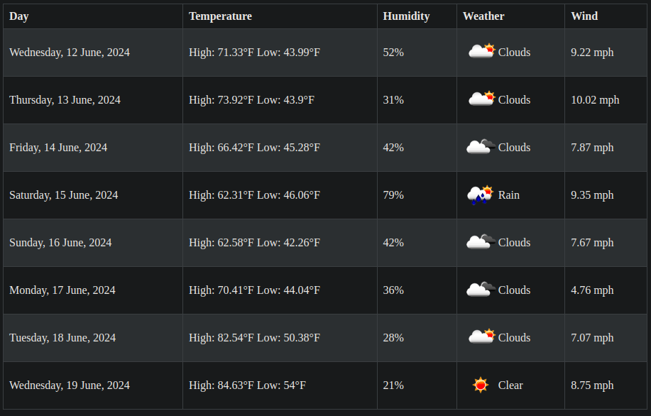

# Weather API
Weather API built with Flask that pulls weather data from OpenWeatherMap

## Features
- Docker-compose dev environment that updates upon changes
- Returns daily weather for the week from lat/lon including:

  - Max/Min Temperatures
  - Humidity
  - Wind
  - Weather(rain etc)
  - Weather icon
- Connected to [main app](https://github.com/Ramsey2022/day_planner) and database via Docker network

# Demo
